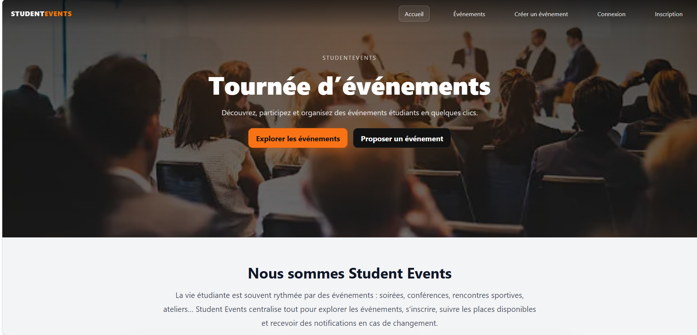
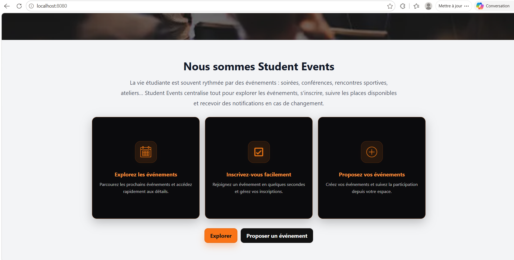
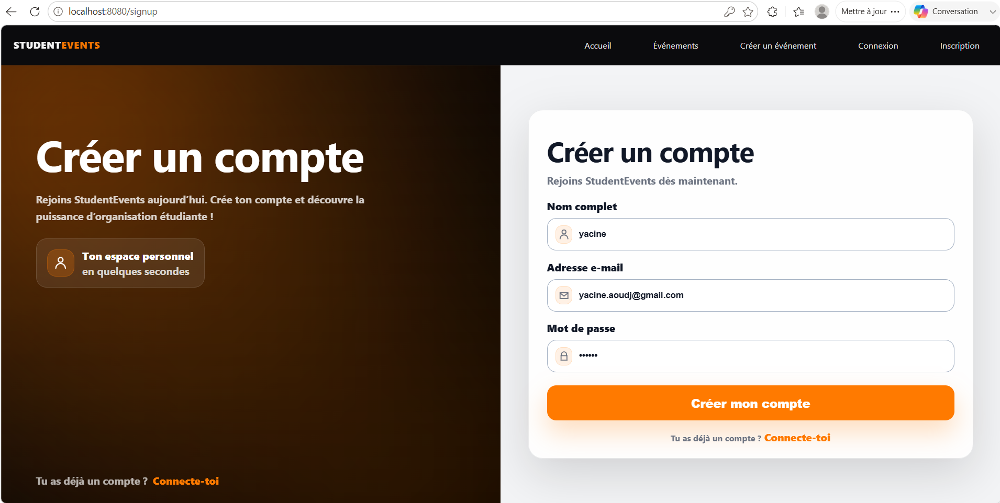
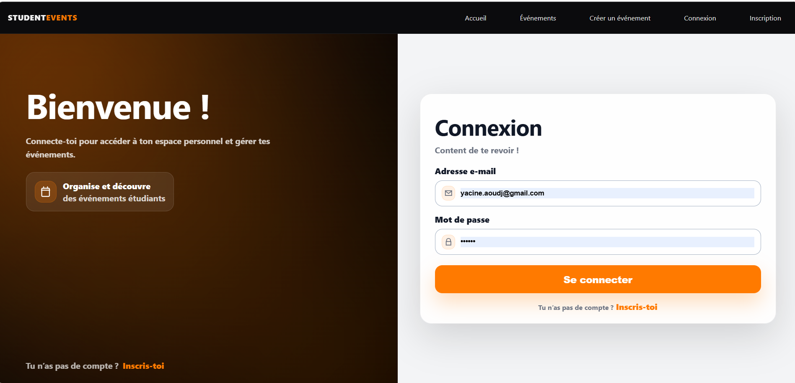
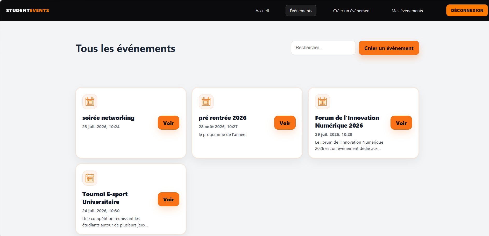
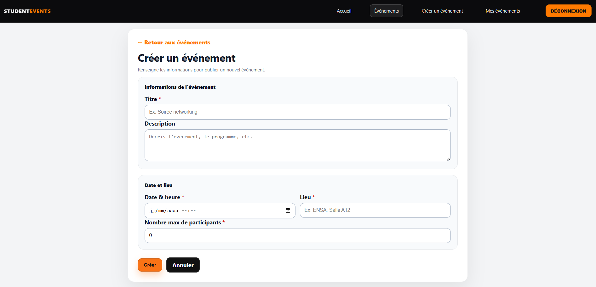
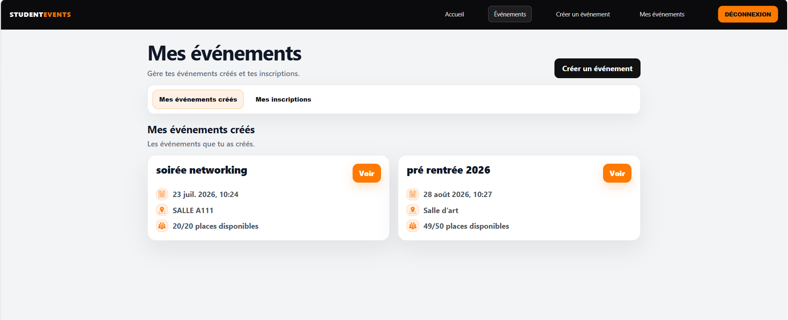
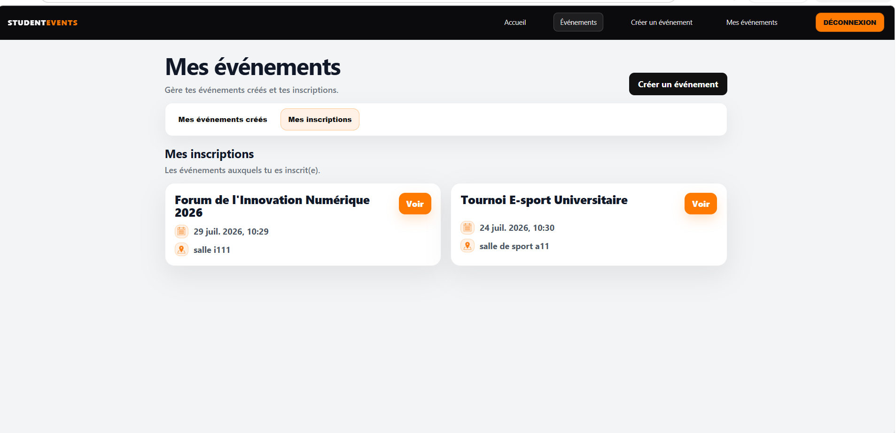

<div align="center">

# StudentEvents

### Plateforme web de gestion d'événements étudiants

Projet universitaire réalisé en équipe de trois étudiants dans le cadre de la Licence 3 MIAGE.


</div>

---

# Présentation

StudentEvents est une application web développée dans le cadre d'un projet universitaire ayant pour objectif de centraliser la gestion des événements étudiants.

La plateforme permet aux utilisateurs de créer des événements, de consulter les événements disponibles, de s'y inscrire et de gérer leurs propres événements depuis un espace personnel.

Ce projet avait également pour objectif de mettre en pratique les principes du DevOps grâce à la mise en place d'une chaîne d'intégration continue, de tests automatisés ainsi que de la conteneurisation de l'application avec Docker.

---

# Contexte du projet

Ce projet a été réalisé en équipe de **trois étudiants** dans le cadre de la Licence 3 MIAGE.

Nous avons travaillé selon une organisation collaborative basée sur **GitFlow**, les **Pull Requests** et une répartition des fonctionnalités afin de développer l'application de manière progressive tout en garantissant la qualité du code grâce aux revues de code et aux tests automatisés.

---

# Ma contribution

Dans le cadre de ce projet, j'ai participé au développement de plusieurs fonctionnalités de l'application ainsi qu'à la mise en œuvre des pratiques DevOps utilisées par l'équipe.

Mes principales contributions portent sur :

| Contribution | Description |
|--------------|-------------|
| Développement Frontend | Participation au développement de plusieurs interfaces utilisateur avec Thymeleaf |
| Développement Backend | Participation à l'implémentation de fonctionnalités avec Spring Boot |
| Gestion des événements | Contribution aux fonctionnalités de création, consultation et gestion des événements |
| Git & GitFlow | Travail collaboratif avec branches Git et Pull Requests |
| DevOps | Participation à la mise en place de Docker, GitHub Actions et des tests automatisés |

---

# Fonctionnalités principales

L'application propose plusieurs fonctionnalités permettant de gérer efficacement les événements étudiants.

- Authentification (inscription, connexion, déconnexion)
- Création d'événements
- Consultation des événements disponibles
- Recherche d'événements
- Gestion des événements créés
- Gestion des inscriptions
- Suivi des places disponibles
- Interface utilisateur responsive

---

# Technologies utilisées

| Catégorie | Technologies |
|-----------|--------------|
| Backend | Java 17 • Spring Boot |
| Frontend | Thymeleaf • HTML • CSS |
| Base de données | H2 Database |
| Build | Maven |
| Tests | JUnit 5 |
| Intégration Continue | GitHub Actions |
| Conteneurisation | Docker |
| Gestion de version | Git • GitHub • GitFlow |

---

# Architecture technique

```text
                     Utilisateur
                          │
                          ▼
               Thymeleaf • HTML • CSS
                          │
                          ▼
                Spring Boot (Java 17)
                          │
          ┌───────────────┴───────────────┐
          ▼                               ▼
     Spring Data JPA                 Services
          │
          ▼
      Base H2
```

---

# Pipeline DevOps

```text
Développement
      │
      ▼
Git / GitFlow
      │
      ▼
Pull Request
      │
      ▼
GitHub Actions
(Build + Tests)
      │
      ▼
Docker
(Build de l'image)
      │
      ▼
Application prête au déploiement
```

---

# Aperçu de l'application

## Accueil

### Vue principale



---

### Présentation de la plateforme



---

## Authentification

### Inscription



---

### Connexion



---

## Gestion des événements

### Liste des événements



---

### Création d'un événement



---

## Espace utilisateur

### Mes événements



---

### Mes inscriptions



---

# Structure du projet

```text
StudentEvents
│
├── .github/
│   └── workflows/
│       └── ci.yml
│
├── events/
│   ├── .mvn/
│   ├── data/
│   ├── src/
│   │   ├── main/
│   │   │   ├── java/
│   │   │   └── resources/
│   │   └── test/
│   │       └── java/
│   │
│   ├── Dockerfile
│   ├── pom.xml
│   ├── mvnw
│   ├── mvnw.cmd
│   └── .gitignore
│
└── README.md
```

---

# Installation

## Prérequis

- Java 17
- Maven
- Docker (optionnel)

## Lancement de l'application

```bash
git clone https://github.com/Zakia-KADI/projet-devops.git

cd projet-devops/events

./mvnw spring-boot:run
```

L'application sera accessible à l'adresse :

```text
http://localhost:8080
```

---

# Compétences développées

Ce projet m'a permis de renforcer mes compétences sur :

- Développement d'applications web avec Spring Boot
- Architecture MVC
- Spring Data JPA
- Base de données H2
- Développement d'interfaces avec Thymeleaf
- Gestion collaborative avec Git et GitFlow
- Intégration continue avec GitHub Actions
- Conteneurisation avec Docker
- Tests automatisés avec JUnit
- Travail en équipe sur un projet collaboratif

---

# Code source

Ce dépôt présente le projet, son architecture ainsi que les principales fonctionnalités développées.

Le code source complet est disponible dans le dépôt GitHub du projet collaboratif : 
**[Projet DevOps - StudentEvents](https://github.com/Zakia-KADI/projet-devops)**

---

# À propos

Ce projet universitaire illustre le développement d'une application web de gestion d'événements étudiants en utilisant Java, Spring Boot et une approche DevOps.

Il met en avant les compétences acquises en développement full stack, en intégration continue, en conteneurisation et en travail collaboratif au sein d'une équipe.
